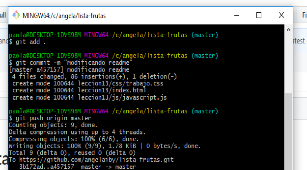

# lista-frutas
### 1 **Primero** cloné mi repositorio

### 2 **Segundo** luego escribi el texto en html
### **Frutas Master**</b> es una empresa familiar de tercera generacion que se dedica a la compra,venta y distribucion de frutas al por mayor . En la actualidad, somos la empresa líder en el servicio de distribucion de frutas.</h4>

### 3 **Tercero** ingrese una imagen descargada de internet de frutas
### 4 **Cuarto** modifique el largo y el ancho de la imagen que inserte  

### 5 **Quinto** luego subi el commit de la imagen que inserte

### 6 **Sexto**  <h3> <b>Catálogo:</b></h3>

### 7 **Septimo** agrege una lista con el nombre de las frutas <h4> 1. Pera   2. Manzana   3. Piña   4. Naranja   5.Cereza </h4>

### 8 **Octavo** subi los nuevos cambios a mi repositorio

